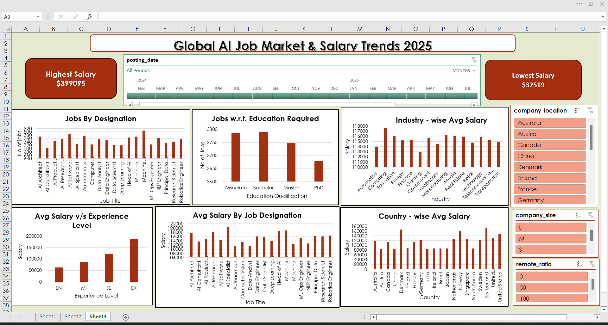

# AI Jobs & Salary Dashboard (Excel)

This Excel dashboard analyzes the global job market for Artificial Intelligence and Machine Learning roles using a dataset of over 15,000 job listings from more than 50 countries.
---
## 📊 Features
- Salary comparison by country, industry, job title, and experience
- Remote work trends (fully remote vs hybrid vs on-site)
- Education and company size insights
- Timeline-based filtering using slicers

## 📁 Files Included
- `ai-jobs-salary-analysis.xlsx` – Main Excel dashboard
- `Dataset.csv` – Cleaned data used
- 'Dashboard.png' – Sample preview of dashboard

## 🛠 Tools Used
- Microsoft Excel 2019 (Power Query + Pivot Tables + Charts)
- Dataset from [Kaggle]([https://www.kaggle.com](https://www.kaggle.com/datasets/bismasajjad/global-ai-job-market-and-salary-trends-2025))
- 
## 🎯 Purpose
- Practice Excel dashboarding
- Understand AI job market dynamics and salary trends
- Showcase end-to-end data analysis skills for portfolio

## 📷 Preview

## ✅ Key Insights

- Executive roles command the highest average salaries
- The average remote work ratio is ~50%, indicating a shift toward hybrid jobs
- US, Germany, and Switzerland offer the most competitive salaries
- Data Scientist and ML Engineer are among the most in-demand roles

